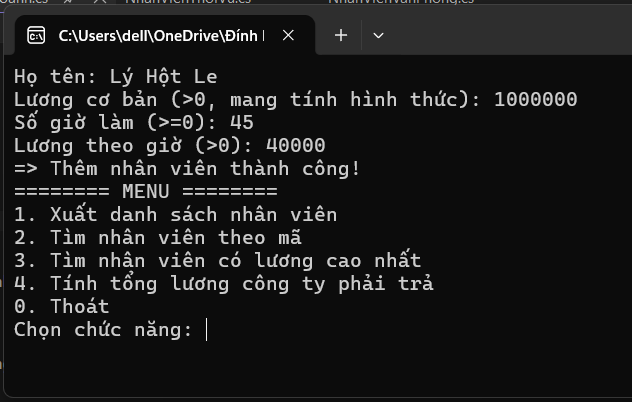
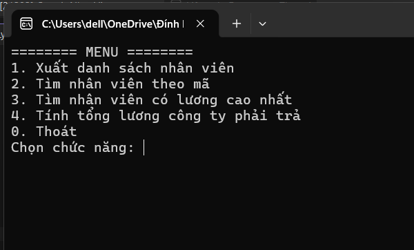
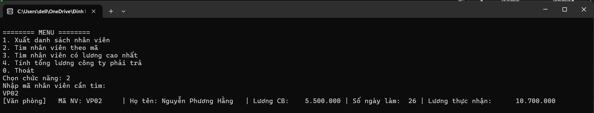
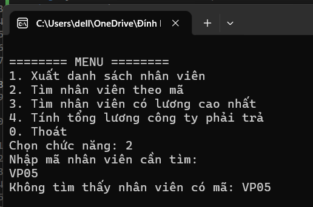
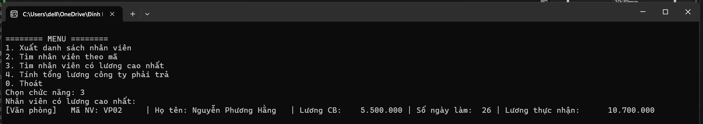
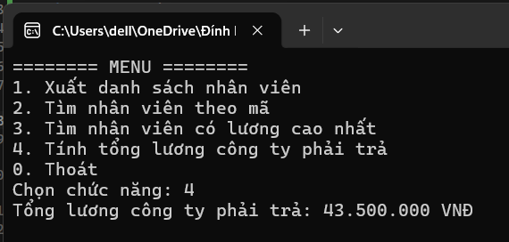

# BÀI TẬP TRÊN LỚP: QUẢN LÝ NHÂN VIÊN

## 1. Giới thiệu tổng quan
Chương trình Console Application viết bằng ngôn ngữ **C# (.NET)** phục vụ việc quản lý danh sách nhân viên công ty. Dự án được thiết kế chuẩn theo các nguyên lý của **Lập trình Hướng đối tượng (OOP)**: Đóng gói (Encapsulation), Kế thừa (Inheritance) và Đa hình (Polymorphism).

---

## 2. Kiến trúc & Thiết kế hướng đối tượng

### 2.1. Cấu trúc các lớp
Mỗi lớp được tách biệt thành từng file mã nguồn riêng (`.cs`):

1. **`NhanVien.cs` (Base Class - Lớp cơ sở)**:
   - Các thuộc tính đóng gói: `MaNV`, `HoTen`, `LuongCoBan` (ràng buộc validation: lương cơ bản > 0, kiểm tra ngay trong property setter).
   - Constructor khởi tạo đầy đủ thông tin lớp cha.
   - Phương thức ảo (`virtual`):
     - `virtual double TinhLuong()`: Trả về mức lương cơ bản.
     - `virtual void HienThiThongTin()`: Xuất định dạng thông tin nhân viên cơ bản.

2. **`NhanVienVanPhong.cs` (Kế thừa từ `NhanVien`)**:
   - Thuộc tính bổ sung: `SoNgayLamViec` (ràng buộc từ 0 đến 31 ngày).
   - Gọi constructor cha thông qua từ khóa `: base(...)`.
   - `override TinhLuong()`: `Lương = Lương cơ bản + Số ngày làm việc × 200.000 VNĐ`.
   - `override HienThiThongTin()`: Xuất thông tin đặc thù của nhân viên văn phòng.

3. **`NhanVienKinhDoanh.cs` (Kế thừa từ `NhanVien`)**:
   - Thuộc tính bổ sung: `DoanhSo` (ràng buộc ≥ 0).
   - Gọi constructor cha thông qua `: base(...)`.
   - `override TinhLuong()`: `Lương = Lương cơ bản + 5% × Doanh số`.
   - `override HienThiThongTin()`: Xuất thông tin doanh số và hoa hồng.

4. **`NhanVienThoiVu.cs` (Kế thừa từ `NhanVien` - Bonus)**:
   - Thuộc tính bổ sung: `SoGioLam` (≥ 0), `LuongTheoGio` (> 0).
   - `override TinhLuong()`: `Lương = Số giờ làm × Lương theo giờ`.
   - `override HienThiThongTin()`: Định dạng hiển thị riêng cho nhân viên thời vụ.

5. **`Program.cs` (Chương trình chính)**:
   - Quản lý danh sách nhân viên bằng `List<NhanVien> danhSach`.
   - Xây dựng menu điều hướng và các hàm nhập liệu có kiểm tra hợp lệ (`NhapSoNguyen`, `NhapSoThuc`).

---

## 3. Các tính năng & Kết quả đạt được

Chương trình quản lý danh sách thông qua cấu trúc dữ liệu `List<NhanVien>` và cung cấp Menu tương tác:

- **Chức năng 1: Xuất danh sách nhân viên**
  - Khởi tạo sẵn danh sách mẫu ít nhất 5 nhân viên thuộc cả 3 loại (Văn phòng, Kinh doanh, Thời vụ) ngay khi chương trình khởi động.
  - Áp dụng **Đa hình (Polymorphism)**: Duyệt danh sách lớp cha `foreach (var nv in danhSach) nv.HienThiThongTin();`. Hệ thống tự động kích hoạt phiên bản ghi đè (`override`) phù hợp mà **không cần dùng `if` / `switch`** để kiểm tra kiểu đối tượng.

- **Chức năng 2: Tìm nhân viên theo mã**
  - Tìm kiếm chính xác mã nhân viên (không phân biệt chữ hoa / chữ thường) bằng `FirstOrDefault`.
  - Xuất thông tin chi tiết nếu tìm thấy hoặc thông báo nếu mã không tồn tại.

- **Chức năng 3: Tìm nhân viên có lương cao nhất**
  - Thuật toán so sánh lương dựa trên việc gọi đa hình `x.TinhLuong()` kết hợp `OrderByDescending`.
  - Đảm bảo tính mở rộng (**Open-Closed Principle**): Dù có thêm loại nhân viên mới (như `NhanVienThoiVu`), thuật toán tìm nhân viên lương cao nhất vẫn giữ nguyên 100%.

- **Chức năng 4: Tính tổng lương công ty phải trả**
  - Tích lũy quỹ lương tự động qua `danhSach.Sum(x => x.TinhLuong())`, không phụ thuộc vào cấu trúc phân loại nhân viên.

- **Cơ chế chống Crash & Xử lý ngoại lệ (Exception Handling)**:
  - Sử dụng `int.TryParse` / `double.TryParse` để chặn nhập chữ/ký tự lạ ở Menu và khi nhập dữ liệu, mà không làm dừng đột ngột chương trình.
  - Xử lý các lựa chọn nằm ngoài khoảng (nhỏ hơn 0 hoặc lớn hơn 4).
  - Bọc phần khởi tạo nhân viên trong khối `try - catch (ArgumentException)` để kiểm soát lỗi dữ liệu đầu vào (ví dụ số ngày làm việc > 31, doanh số âm...).

---

## 4. Hướng dẫn biên dịch & Chạy chương trình

**Cách 1 - Visual Studio 2022:**
1. Mở file `QuanLyNhanVien.csproj` trong thư mục bài tập bằng **Visual Studio 2022**.
2. Nhấn **F5** (hoặc nút **Start**) để biên dịch và khởi chạy chương trình Console.

**Cách 2 - Dòng lệnh (.NET SDK 8.0 trở lên):**
```bash
cd BTLOP/16092026
dotnet run
```

3. Chọn các chức năng tương ứng từ Menu:
   - Nhập `1`: Xem danh sách.
   - Nhập `2`: Tra cứu mã.
   - Nhập `3`: Xem nhân viên lương cao nhất.
   - Nhập `4`: Xem tổng quỹ lương.
   - Nhập `0`: Thoát ứng dụng.

---

## 5. Kết quả chạy chương trình

1. **Nhập danh sách nhân viên ban đầu:**


2. **Menu chính và chức năng xem danh sách:**



3. **Chức năng tìm nhân viên theo mã:**



4. **Chức năng tìm nhân viên có lương cao nhất:**


5. **Chức năng tính tổng lương công ty phải trả:**



---

## 6. Cấu trúc thư mục

```
BTLOP/
└── 16092026/
    ├── NhanVien.cs
    ├── NhanVienVanPhong.cs
    ├── NhanVienKinhDoanh.cs
    ├── NhanVienThoiVu.cs
    ├── Program.cs
    ├── QuanLyNhanVien.csproj
    ├── README.md
    └── images/
        ├── nhap-danh-sach.png
        ├── menu.png
        ├── xemDS.png
        ├── timTheoMa.png
        ├── timTheoMa2.png
        ├── timLuongMax.png
        └── tongLuong.png
```

---

## 7. Hướng dẫn push lên GitHub cá nhân
