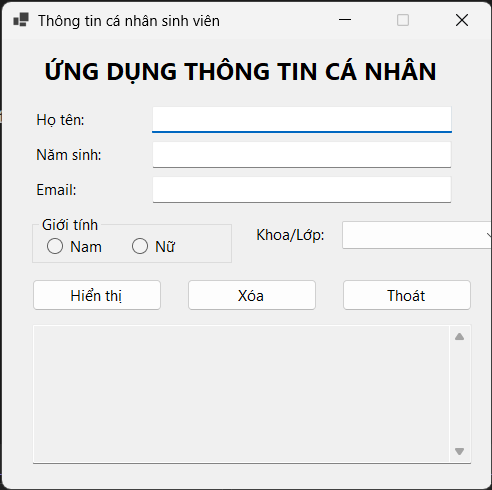
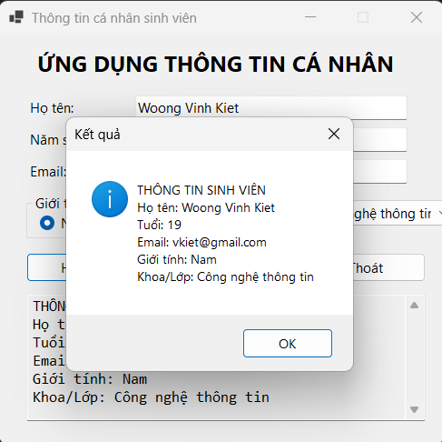
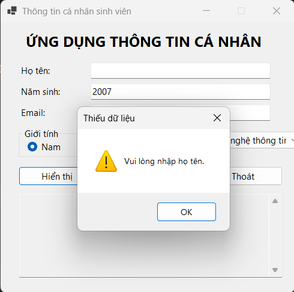
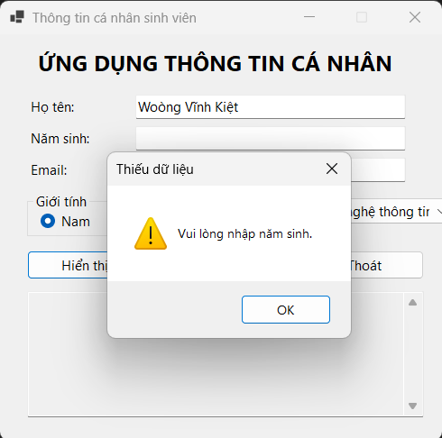
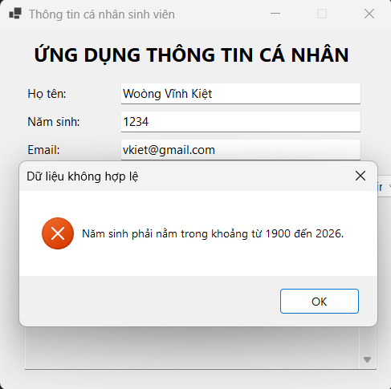
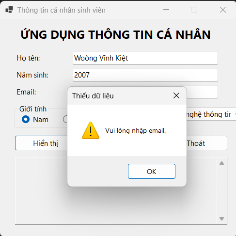
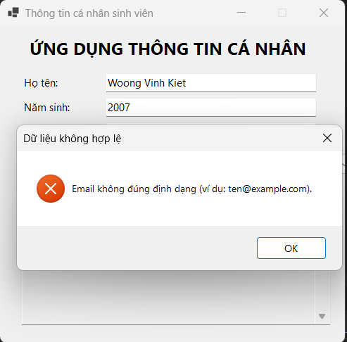
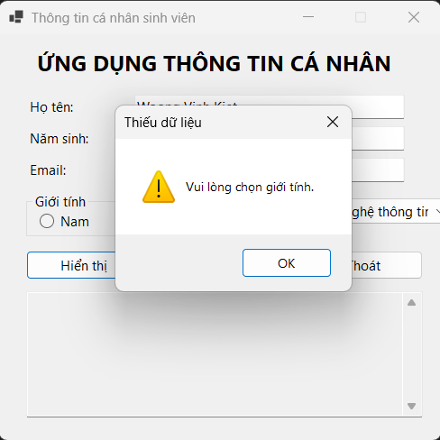
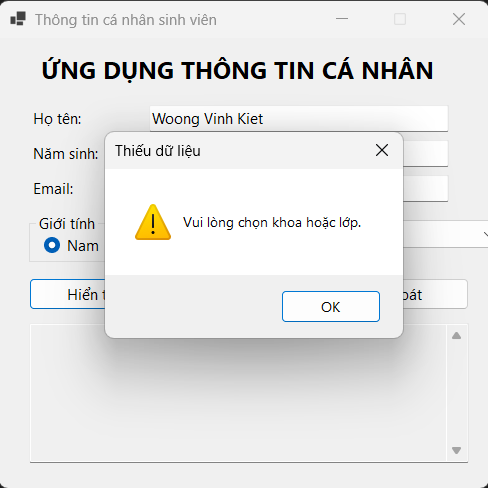
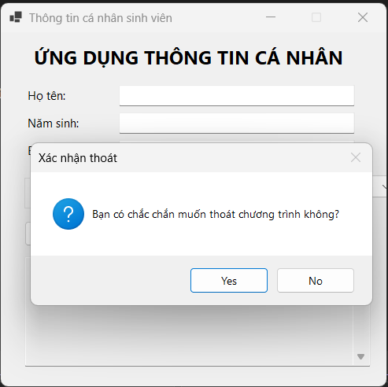

# Lab 01 - Ứng dụng Thông tin cá nhân
## 1. Mô tả
Ứng dụng Windows Forms cho phép nhập thông tin cá nhân sinh viên (họ tên, năm sinh,
email, giới tính, khoa/lớp), kiểm tra tính hợp lệ của dữ liệu, tính tuổi và hiển thị
kết quả tổng hợp. Có chức năng Xóa dữ liệu và Thoát chương trình (có xác nhận).

## 2. Công nghệ sử dụng
- C# Windows Forms
- .NET 8

## 3. Danh sách control chính

| Control      | Tên biến    | Chức năng                |
|--------------|-------------|--------------------------|
| TextBox      | txtHoTen    | Nhập họ tên              |
| TextBox      | txtNamSinh  | Nhập năm sinh            |
| TextBox      | txtEmail    | Nhập email               |
| RadioButton  | radNam/radNu| Chọn giới tính           |
| ComboBox     | cboKhoa     | Chọn khoa/lớp            |
| Button       | btnHienThi  | Hiển thị kết quả         |
| Button       | btnXoa      | Xóa dữ liệu đã nhập      |
| Button       | btnThoat    | Thoát chương trình       |
| TextBox      | txtKetQua   | Hiển thị kết quả tổng hợp|

## 4. Kiểm tra dữ liệu đầu vào
- Họ tên không được rỗng.
- Năm sinh không được rỗng, phải là số nguyên, trong khoảng 1900 - năm hiện tại.
- Email không được rỗng, phải đúng định dạng email.
- Phải chọn giới tính.
- Phải chọn khoa/lớp.

## 5. Hình ảnh kết quả

### 5.1 Giao diện khi mở chương trình

### 5.2 Kết quả khi nhập dữ liệu hợp lệ

### 5.3 Thông báo khi thiếu tên

### 5.4 Thông báo khi thiếu tuổi và sai tuổi

### 5.5 Thông báo khi thiếu email và sai email

### 5.6 Thông báo khi thiếu giới tính

### 5.7 Thông báo khi thiếu khoa/lớp

### 5.8 Xác nhận Thoát

## 6. Ghi chú
- Chương trình đã được kiểm tra và chạy đúng theo yêu cầu đề bài.
