# Lab 02 - Quản lý mảng số nguyên bằng Console (C#)

## 1. Mô tả bài toán

Chương trình Console C# quản lý một mảng số nguyên. Người dùng thao tác thông qua menu, chọn chức năng cần thực hiện. Sau khi thực hiện xong, chương trình quay lại menu cho đến khi người dùng chọn thoát.

## 2. Chức năng chương trình

| Lựa chọn | Chức năng | Mô tả |
|---|---|---|
| 1 | Nhập mảng | Nhập số lượng phần tử n (số nguyên dương) và n phần tử của mảng |
| 2 | Xuất mảng | In toàn bộ phần tử của mảng ra màn hình |
| 3 | Tính tổng | Tính và in tổng các phần tử trong mảng |
| 4 | Tìm lớn nhất và nhỏ nhất | In giá trị lớn nhất và nhỏ nhất trong mảng |
| 5 | Đếm chẵn/lẻ | Đếm số lượng phần tử chẵn và số lượng phần tử lẻ |
| 6 | Sắp xếp tăng dần | Sắp xếp mảng theo thứ tự tăng dần và in kết quả |
| 7 | Tìm kiếm | Nhập giá trị x, kiểm tra x có trong mảng không, in vị trí xuất hiện đầu tiên nếu có |
| 0 | Thoát | Kết thúc chương trình |

## 3. Cấu trúc chương trình

Chương trình được tách thành các phương thức nhỏ, `Main` chỉ đóng vai trò điều khiển menu và gọi hàm tương ứng:

- `HienThiMenu()` - hiển thị menu ra màn hình
- `KiemTraDaNhapMang()` - kiểm tra người dùng đã nhập mảng chưa trước khi cho xử lý các chức năng khác
- `NhapSoNguyen(string message)` - nhập một số nguyên, kiểm tra hợp lệ (dùng `int.TryParse`)
- `NhapSoNguyenDuong(string message)` - nhập một số nguyên dương (dùng cho số lượng phần tử n)
- `NhapMang()` - nhập số lượng phần tử và giá trị từng phần tử của mảng
- `XuatMang(int[] a)` - in toàn bộ phần tử của mảng
- `TinhTong(int[] a)` - tính tổng các phần tử
- `TimMax(int[] a)` / `TimMin(int[] a)` - tìm giá trị lớn nhất / nhỏ nhất
- `DemChan(int[] a)` / `DemLe(int[] a)` - đếm số lượng phần tử chẵn / lẻ
- `SapXepTangDan(int[] a)` - sắp xếp mảng tăng dần (thuật toán Bubble Sort)
- `TimKiem(int[] a, int x)` - tìm kiếm tuyến tính, trả về vị trí đầu tiên tìm thấy hoặc -1 nếu không có

## 4. Xử lý lỗi và kiểm tra dữ liệu nhập

- Nếu người dùng nhập sai định dạng (không phải số) ở bất kỳ đâu, chương trình yêu cầu nhập lại thay vì bị dừng đột ngột.
- Số lượng phần tử n bắt buộc phải là số nguyên dương; nếu nhập 0 hoặc số âm, chương trình yêu cầu nhập lại.
- Nếu người dùng chưa thực hiện chức năng "Nhập mảng" mà chọn các chức năng 2-7, chương trình thông báo và không cho thực hiện.
- Nếu người dùng chọn một mục không có trong menu, chương trình thông báo lựa chọn không hợp lệ và cho chọn lại, không bị crash.

## 5. Cách chạy chương trình

1. Mở project bằng Visual Studio.
2. Nhấn **F5** hoặc **Ctrl+F5** để chạy chương trình (Console App .NET).
3. Làm theo hướng dẫn trên menu để sử dụng các chức năng.

## 6. Dữ liệu kiểm thử

| STT | Dữ liệu nhập | Kết quả mong đợi |
|---|---|---|
| 1 | Mảng: 4 1 9 2 7 | Tổng = 23, max = 9, min = 1, chẵn = 2, lẻ = 3 |
| 2 | Mảng: -3 0 8 -1 | Tổng = 4, max = 8, min = -3, chẵn = 2, lẻ = 2 |
| 3 | Tìm x = 9 trong mảng 4 1 9 2 7 | Tìm thấy, vị trí đầu tiên là 2 (tính từ 0) |
| 4 | Tìm x = 5 trong mảng 4 1 9 2 7 | Không tìm thấy |
| 5 | Nhập n = 0 hoặc số âm | Chương trình yêu cầu nhập lại |

## 7. Hình ảnh minh chứng

### Ảnh menu chương trình

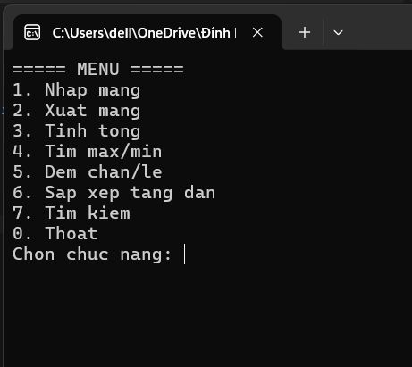

### Chức năng nhập mảng và báo lỗi khi chưa nhập mảng

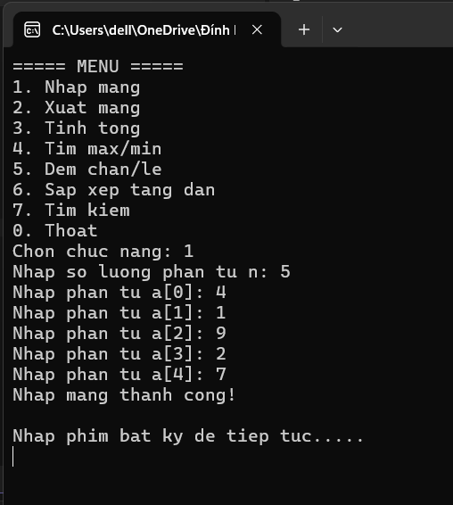
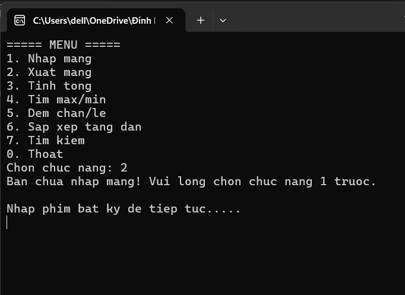

### Chức năng xuất mảng

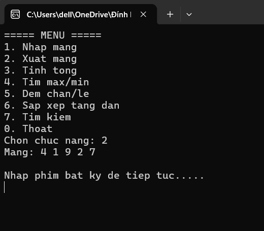

### Chức năng tính tổng

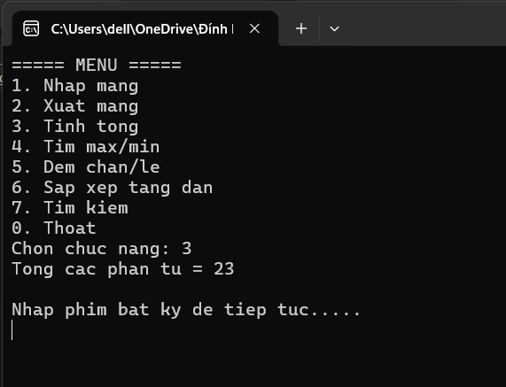

### Chức năng tìm max/min

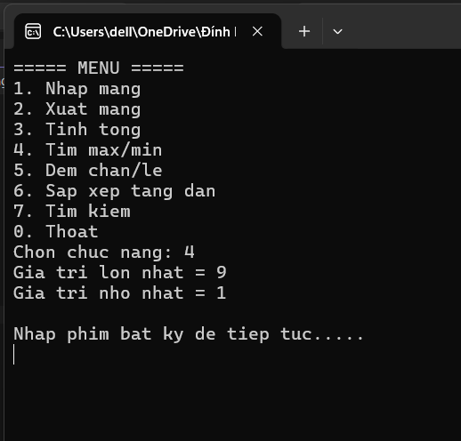

### Chức năng đếm chẵn/lẻ

### Chức năng sắp xếp tăng dần 

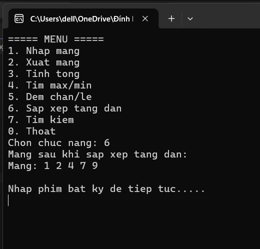

### Chức năng tìm kiếm 

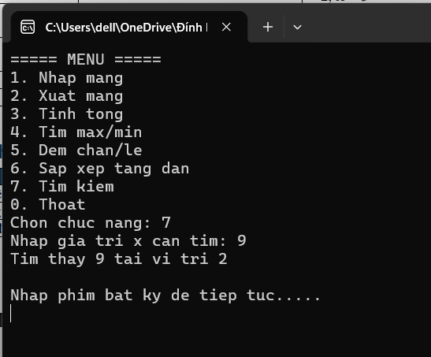
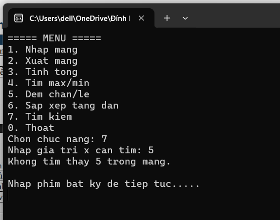

### Lỗi nhập sai định dạng 

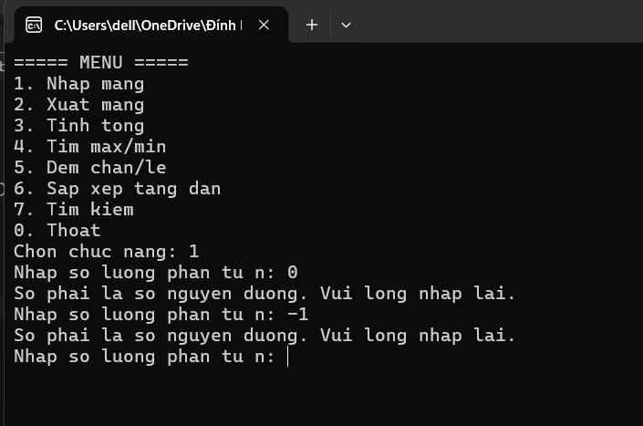

### Thoát 

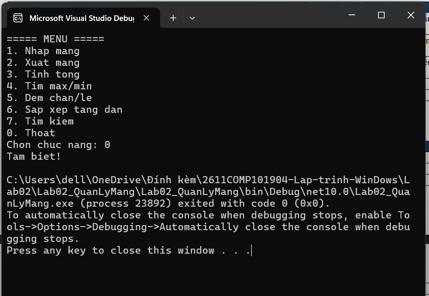