# Lab 03 - Quản lý sinh viên bằng Console (COMP1019)

Chương trình Console C# quản lý sinh viên theo hướng đối tượng, lưu dữ liệu trong `List<SinhVien>`.

## Cấu trúc

```
Lab03_QuanLySinhVienOOP
|-- Nguoi.cs              // class cha: HoTen, NgaySinh, LayThongTin() virtual
|-- SinhVien.cs           // kế thừa Nguoi: MaSinhVien, MaLop, DiemTrungBinh (0-10), XepLoai()
|-- QuanLySinhVien.cs     // service: Them, Sua, Xoa, TimTheoMa, TimTheoTen, SapXepTheoDiem, LayDanhSach
|-- Program.cs            // menu + các hàm nhập liệu an toàn
```

## Công nghệ sử dụng

- - C# Windows Forms
- .NET 

## Đối chiếu yêu cầu

| Yêu cầu | Nơi thể hiện |
|---|---|
| Class, property, constructor | `Nguoi`, `SinhVien` đều có constructor mặc định và đầy đủ |
| Kế thừa + override | `SinhVien : Nguoi`, override `LayThongTin()` |
| Property kiểm tra dữ liệu | Setter của `DiemTrungBinh` chỉ nhận 0–10, ném `ArgumentOutOfRangeException` |
| `List<SinhVien>` | Field `_danhSach` trong `QuanLySinhVien`, `private readonly`, Main không đụng trực tiếp |
| LINQ | `Any`, `FirstOrDefault`, `Where`, `OrderByDescending`, `Average` trong `QuanLySinhVien` |
| Không crash khi nhập sai | `NhapChuoi`, `NhapDiem`, `NhapNgay` dùng `TryParse` và lặp lại đến khi hợp lệ |
| Tách hàm | Mỗi chức năng menu là một method riêng trong `Program` |

## Quy ước xếp loại

| Điểm | Xếp loại |
|---|---|
| >= 9 | Xuất sắc |
| >= 8 | Giỏi |
| >= 6.5 | Khá |
| >= 5 | Trung bình |
| < 5 | Yếu |

Sinh viên "đạt" = điểm trung bình >= 5.

## Hình ảnh kết quả

### Menu 

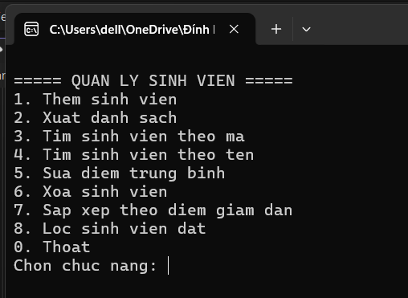
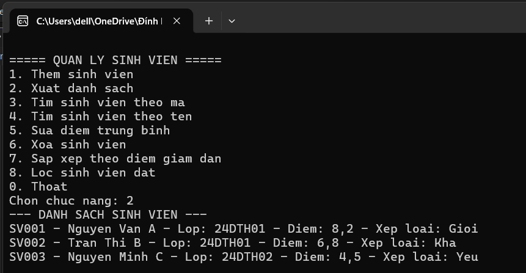

### Thêm sinh viên

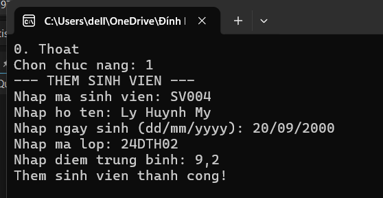

#### Lỗi trùng mã
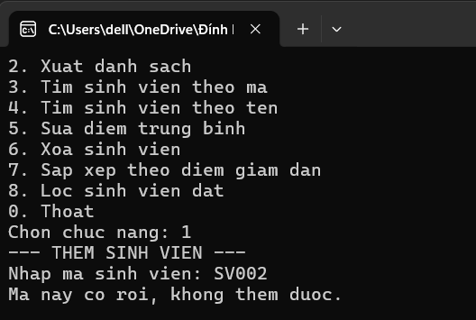

#### Lỗi sai định dạng (dd/mm/yyyy)
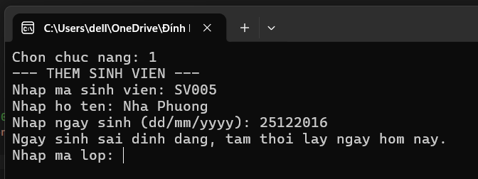

#### Lỗi điểm ngoài 0–10
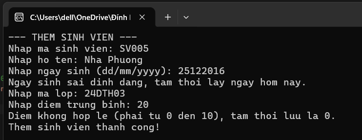

### Xuất danh sách
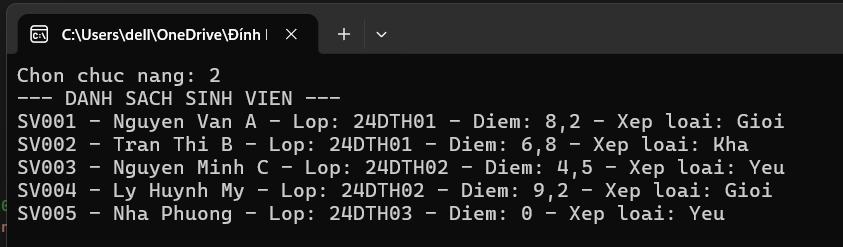

### Tìm sinh viên theo mã
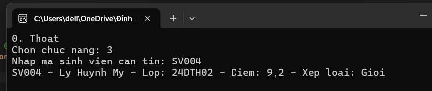
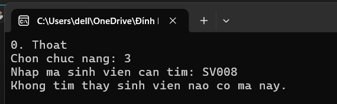

### Tìm sinh viên theo tên
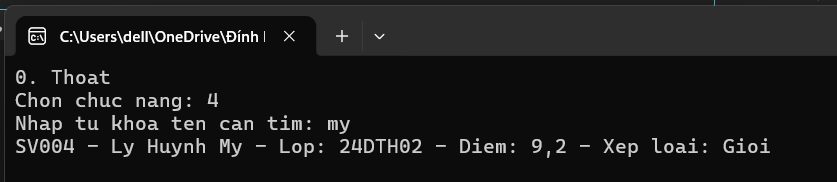
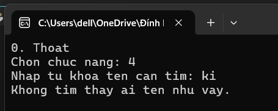

### Sửa điểm 
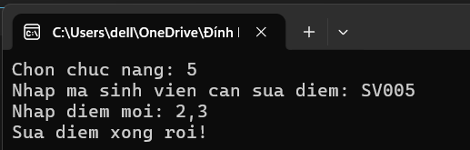
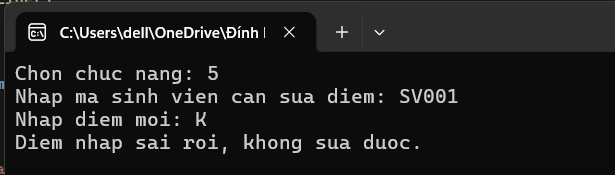

### Xóa sinh viên
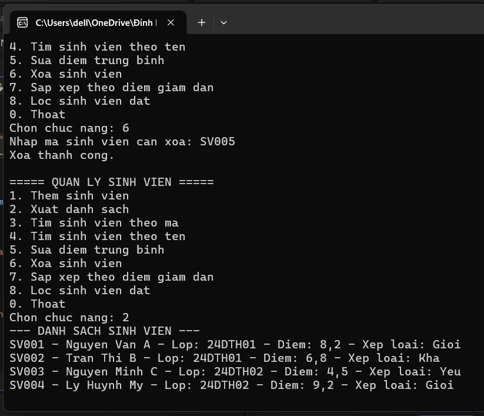

### Sắp xếp theo điểm giảm dần
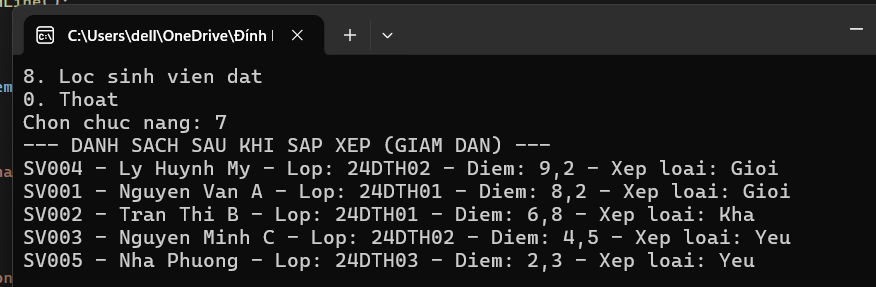

### Lọc sinh viên đạt
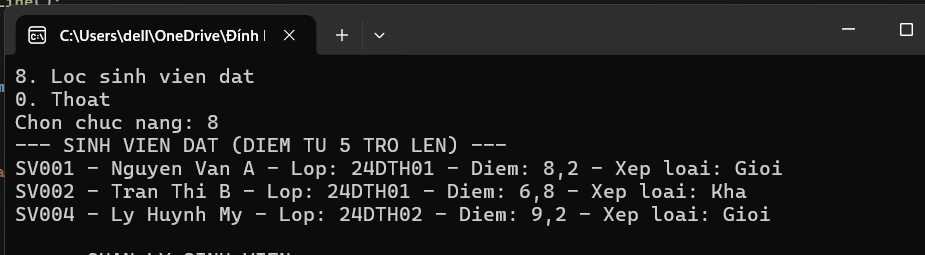

### Thoát chương trình
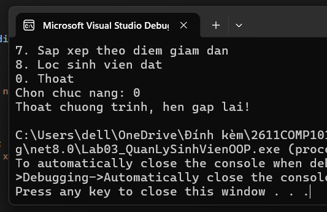
